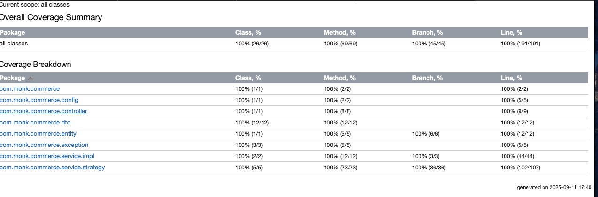

# Coupons Management API for Monk Commerce

This project is a RESTful API for managing and applying various types of discount coupons for an e-commerce platform. It
is built with Spring Boot, Java 17, and uses an embedded SQLite database.

## Table of Contents

1. [Implemented Cases](#implemented-cases)
2. [Unimplemented Cases](#unimplemented-cases)
3. [Limitations](#limitations)
4. [Assumptions](#assumptions)
5. [API Endpoints](#api-endpoints)
6. [Extensibility](#extensibility)
7. [Test Coverage](#test-coverage)

---

## Implemented Cases

### 1. Cart-Wise Coupons

- Provides a discount when the total cart value exceeds a specified threshold.
- Example: If the threshold is ₹100 and the discount is 10%, then a cart worth ₹440 gets a discount of ₹44.

### 2. Product-Wise Coupons

- Provides a discount on a specific product in the cart.
- Example: If product ID 1 has a 20% discount and the customer buys 6 units at ₹50 each, the discount applied is ₹60.

### 3. BxGy (Buy X, Get Y) Coupons

- Customer buys a specified quantity of eligible products and receives certain products for free (with a repetition
  limit).
- Example: If the threshold is ₹100 and the discount is 10%, then a cart worth ₹440 gets a discount of ₹44.Example: Buy
  3 items from products [1,2] and get 1 item of product [3] free, up to 2 repetitions.
- The discount is calculated based on the price of the cheapest eligible “get” products in the cart.

---

## Unimplemented Cases

### 1. Coupon Stacking / Combination Rules

- Could not implement rules for applying multiple coupons together (e.g., product-wise + cart-wise).
- Example: Requires a rules engine to manage precedence and conflicts.

### 2. Advanced Discount Types

- Fixed amount discounts (₹100 off).
- Percentage discounts with a cap (20% off, up to ₹150).
- Category-wise discounts.
- Free shipping.

### 3. Advanced Constraints

- Global usage limits (e.g., valid only for first 500 uses).
- Per-user usage limits (e.g., one use per customer).
- Segment-specific coupons (e.g., only for new users).
- Payment method–specific discounts.

---

## Limitations

1. **No Coupon Stacking**: As mentioned, the most significant limitation is the inability to combine multiple coupons. A
   dedicated `CouponApplicationService` with a rules engine would be needed to implement this.
2. **Stateless Cart**: For a production system, cart state should be persisted on the server, likely linked to a user
   session.
3. **Basic Validation**: Input validation is basic. It could be enhanced with more specific business rule validations (
   e.g., ensuring discount percentages are between 1 and 100).
4. **Database**: The embedded SQLite database is for development convenience and is not suitable for a production
   environment. It should be replaced with a robust database like PostgreSQL or MySQL.
5. **Security**: The API is not secured. In a real-world scenario, endpoints should be protected using Spring Security (
   e.g., JWT, OAuth2).
6. **Asynchronous Operations**: For high-traffic scenarios, operations like checking coupon applicability could be
   optimized, potentially with caching layers (e.g., Redis).

---

## Assumptions

1. **Single Coupon Application**: The `/apply-coupon/{id}` endpoint assumes only one coupon can be applied to a cart at
   a time. The system does not currently support coupon stacking.
2. **Client-Side Cart State**: The API is stateless. The entire cart object is passed in each request. The server does
   not maintain cart state between calls.
3. **Authoritative Pricing**: The `price` for each item is provided in the request payload. The API does not have its
   own product price catalog.
4. **BxGy Discount Logic**: For BxGy coupons, when multiple eligible "get" items are in the cart, the discount is always
   applied to the cheapest ones first to maximize customer savings.

---

## API Endpoints

(Note: `{{host}}` is `http://localhost:8080/api/v1/coupons`)

### 1. Create a new Coupon

- **Endpoint**: `POST /coupons`
- **Description**: Creates a new coupon. The structure of the `details` object changes based on the `type`.
- **Sample Payloads**:
    - **Cart-wise**:
      ```json
      {
        "type": "CART_WISE",
        "details": {
          "threshold": 500,
          "discount": 10,
          "expiryDate": "2025-12-31"
        }    
      }
      ```
    - **Product-wise**:
      ```json
      {
        "type": "PRODUCT_WISE",
        "details": {
          "productId": "prod-123",
          "discount": 25
        }
      }
      ```
    - **BxGy (Buy X, Get Y)**:
      ```json
      {
        "type": "BXGY",
        "details": {
          "buyProducts": [{
              "productId": 1,
              "quantity": 3
           },
           {
              "productId": 2,
              "quantity": 3
           }],
          "getProducts": [{
              "productId": 3,
              "quantity": 1
           }],
          "repetitionLimit": 3
        }
      }
      ```

### 2. Retrieve All Coupons

- **Endpoint**: `GET /coupons`

### 3. Retrieve a Specific Coupon

- **Endpoint**: `GET /coupons/{id}`

### 4. Update a Coupon

- **Endpoint**: `PUT /coupons/{id}`

### 5. Delete a Coupon

- **Endpoint**: `DELETE /coupons/{id}`

### 6. Fetch Applicable Coupons for a Cart

- **Endpoint**: `POST /applicable-coupons`
- **Description**: Takes a cart object and returns a list of all coupons that can be applied, along with the calculated
  discount for each.
- **Sample Payload**:
  ```json
  {
    "items": [
      { 
        "productId": 1, 
        "quantity": 2, 
        "price": 200.0 
      },
      { 
        "productId": 2, 
        "quantity": 1, 
        "price": 350.0 
      }
    ]
  }
  ```
- **Sample Response**:
  ```json
  {
    "applicableCoupons": [
      {
        "couponId": 1,
        "type": "CART_WISE",
        "discount": 75.0
      }
    ]
  }
  ```

### 7. Apply a Coupon to a Cart

- **Endpoint**: `POST /apply-coupon/{id}`
- **Description**: Applies a specific coupon to a cart and returns the updated cart state with discounts applied.
- **Sample Payload**:

  ```json
  {
  "items": [
    {
      "productId": 1,
      "quantity": 2,
      "price": 200.0
    },
    {
      "productId": 2,
      "quantity": 1,
      "price": 350.0
    }
   ]
  }

- **Sample Response**:

  ```json
  {
    "items": [
      {
        "productId": 1,
        "quantity": 2,
        "price": 200.0,
        "totalDiscount": 0.0
      },
      {
        "productId": 2,
        "quantity": 1,
        "price": 350.0,
        "totalDiscount": 0.0
      }
    ],
    "totalPrice": 750.0,
    "totalDiscount": 75.0,
    "finalPrice": 675.0
  }
  ```

---

## Extensibility

### Why its easy?

1. Strategy-based architecture: Each coupon type has its own CouponStrategy implementation (CartWiseCouponStrategy,
   BxGyCouponStrategy, etc.). This isolates logic per type.
2. Polymorphic details: CouponDetails interface allows each type to have its own structure, and the service dynamically
   parses it.
3. Factory usage: CouponStrategyFactory dynamically picks the correct strategy based on the coupon type. You don’t have
   to modify existing code.
4. Optional expiry logic: Adding expiry is just a common check in the strategy or service, no changes to the
   type-specific logic.

### Steps to add a new coupon type

1. Create a new CouponDetails implementation

```java
  public record NewCouponDetails(
        double someParam,
        LocalDate expiryDate
) implements CouponDetails {
}
  ```

2. Create a new strategy class

```java
@Component
@CouponHandler(CouponType.NEW_TYPE)
public class NewCouponStrategy implements CouponStrategy {
    @Override
    public CouponType getType() { return CouponType.NEW_TYPE; }

    @Override
    public boolean isApplicable(CartRequest cart, CouponResponse coupon) { ... }

    @Override
    public double calculateDiscount(CartRequest cart, CouponResponse coupon) { ... }

    @Override
    public ApplyCouponResponse applyCoupon(CartRequest cart, CouponResponse coupon) { ... }
}
  ```

3. Register the new type in CouponType enum
4. The factory automatically picks up the new strategy (because the strategy is annotated with @CouponHandler and
   CouponStrategyFactory maps type → strategy).
5. Optional: Add any new fields to JSON parsing if needed (expiryDate is already supported in all CouponDetails).

---

## Test Coverage

